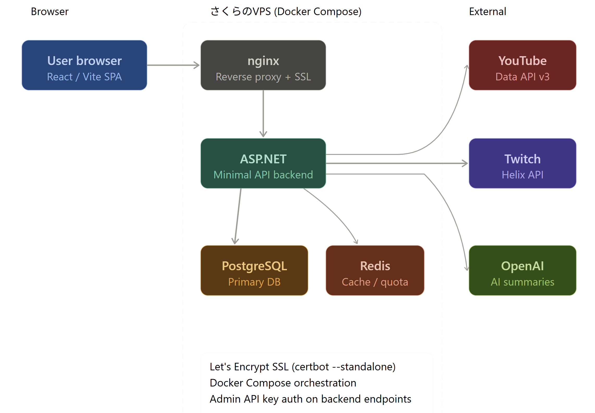

# Vindies

現在 YouTube・Twitch でライブ配信中の個人勢 VTuber 動画を一覧表示する Web アプリケーション。

🔗 **[vindies.jp](https://vindies.jp)**

---

## 概要

企業に所属しない「個人勢 VTuber」のライブ配信を横断的に確認できるサービスです。  
YouTube と Twitch のAPIをリアルタイムで取得し、現在配信中の動画を一覧表示します。  
また、OpenAI API を用いたチャンネル要約機能も備えています。

---

## 技術スタック

### フロントエンド

| 技術  | 用途                   |
| ----- | ---------------------- |
| React | UIコンポーネント構築   |
| Vite  | ビルドツール・開発環境 |

### バックエンド

| 技術                | 用途               |
| ------------------- | ------------------ |
| ASP.NET Minimal API | REST API サーバー  |
| PostgreSQL          | データベース       |
| Redis               | キャッシュサーバー |

### インフラ

| 技術                    | 用途                        |
| ----------------------- | --------------------------- |
| Docker / Docker Compose | コンテナ化・環境統一        |
| nginx                   | リバースプロキシ・HTTPS対応 |
| さくらのVPS             | 本番サーバー                |
| GitHub Actions          | Dockerイメージのビルド(CI)  |

---

## アーキテクチャ



---

## 主な機能

- YouTube・Twitch の配信中 VTuber 動画を一覧表示
- リアルタイムでのライブ配信情報取得
- 企業勢 VTuber のチャンネルIDデータベースを保持し、API検索結果から除外(フィルタリング)
- OpenAI API を用いたチャンネル要約機能

---

## 工夫した点

- **外部API呼び出しの一元化**: フロントエンドから直接 YouTube/Twitch API を呼ぶ構成だと、利用者数に比例してAPI使用量が増え、クォータ管理が困難になる。そのため外部API呼び出しはすべてバックエンドに集約し、取得結果を Redis にキャッシュ。フロントエンドはバックエンドのキャッシュを参照するだけにすることで、利用者数に依存しない安定したAPI使用量を実現した。

- **管理系エンドポイントのアクセス制限**: 企業勢VTuberのフィルタリング用DBはフロントエンド側に編集用の口を設けると不正アクセスのリスクが増えるため、公開しない設計とした。編集は自作の WPF アプリケーションから HTTP リクエストでバックエンドに送信する形にし、リクエストヘッダーに自作のAPIキーを付与することで、アクセスできるクライアントを制限しセキュリティを強化した。

- **AI要約機能のモデル選定**: チャンネル要約機能では、レスポンスを決まった JSON 形式で受け取る必要がある。OpenAI API は Structured Outputs の strict モードにより、指定したスキーマに厳密に従った JSON を高い精度で返せる点を評価し採用した。

---

## デプロイ

GitHub Actions で Docker イメージのビルドを自動化。VPSへのデプロイは現状まだ手動で、ビルド済みイメージを `docker pull` して反映している。

必要な設定ファイル:

- `./.env`
  - docker の起動時に読み込む `POSTGRES_USER`, `POSTGRES_PASSWORD`, `POSTGRES_DB` を設定
- `backend/appsettings.Docker.json`
  - 各種 api キー、 db へのコネクションストリングを設定

---

## ローカル開発環境のセットアップ

```bash
# リポジトリのクローン
git clone https://github.com/YOUR_USERNAME/YOUR_REPO.git
cd YOUR_REPO

# Docker Compose で起動
docker compose up -d
```

- `./.docker-compose.override.yml`
  - 開発時の docker 構成
- `./.env`
  - docker の起動時に読み込む `POSTGRES_USER`, `POSTGRES_PASSWORD`, `POSTGRES_DB` を設定
- `backend/appsettings.Docker.json`
  - 各種 api キー、 db へのコネクションストリングを設定
- `backend/appsettings.Development.json`
  - 各種 api キー、 db へのコネクションストリングを設定 asp.net をデバッグで動かす時はこちらを使用する

---
